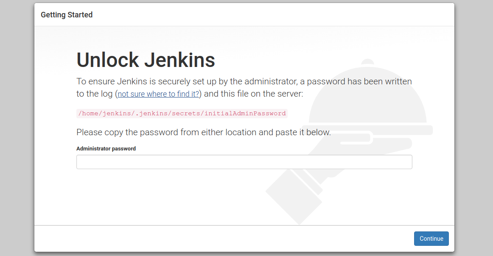
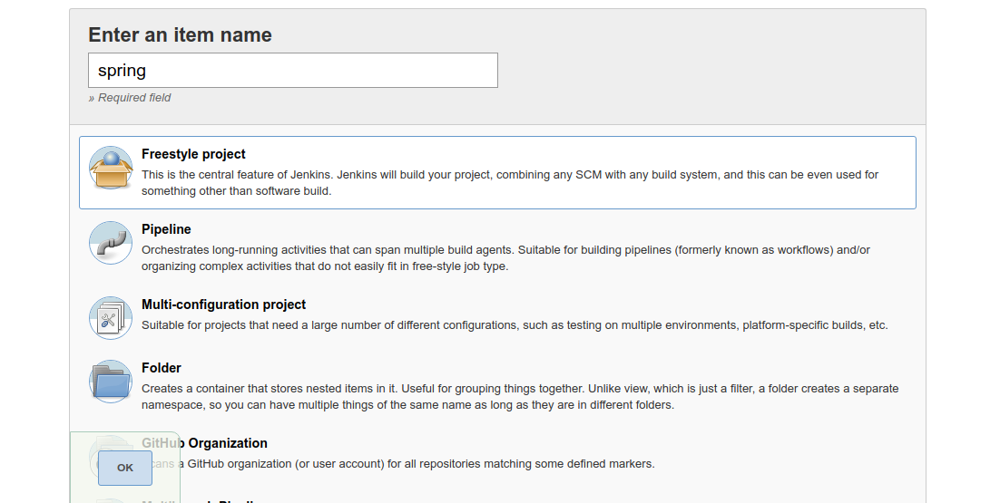

# spring-installer
script to install jenkins and the spring-boot-hello-world server

## setup
### clone the project
```bash
#git clone https://github.com/bob-crutchley/spring-installer-example
git clone https://github.com/ajb1234/spring-installer
cd spring-installer
```

### run the install scripts
this will install jenkins and the spring service (you will sudo access for this)
```bash
bash install.sh
```
### follow the jenkins setup
jenkins can be accessed from port `8080`, follow the guided setup of jenkins, selecting the default options



### create a job in jenkins
on the jenkins home page select `create new jobs` or `New Item` and create a freestyle project.


#### set the GitHub repository and branch
configure the jenkins job to use the `spring-boot-hello-world` project on the `port-9000` branch


#### set the job to build on changes to the branch
configure poll SCM so that jenkins checks for a change on the `port-9000` branch every 1 minute


### configure the build script
under the build section click `Add build step > Execute shell` and enter the script below
```bash
# create the application jar file
mvn clean package
# copy the jar file to the spring user home
sudo cp target/hello-world-0.0.1-SNAPSHOT.jar /home/spring/app.jar
# make sure that the spring user owns the jar file
sudo chown spring:spring /home/spring/app.jar
# restart the spring service
sudo systemctl restart spring
```
it should look something like this in the jenkins job configuration


### save the job configuration
click the `Save` button at the bottom of the screen  
whenever a change is made to the `port-9000` branch now the jenkins job will execute
